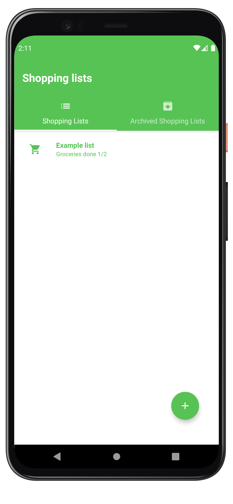
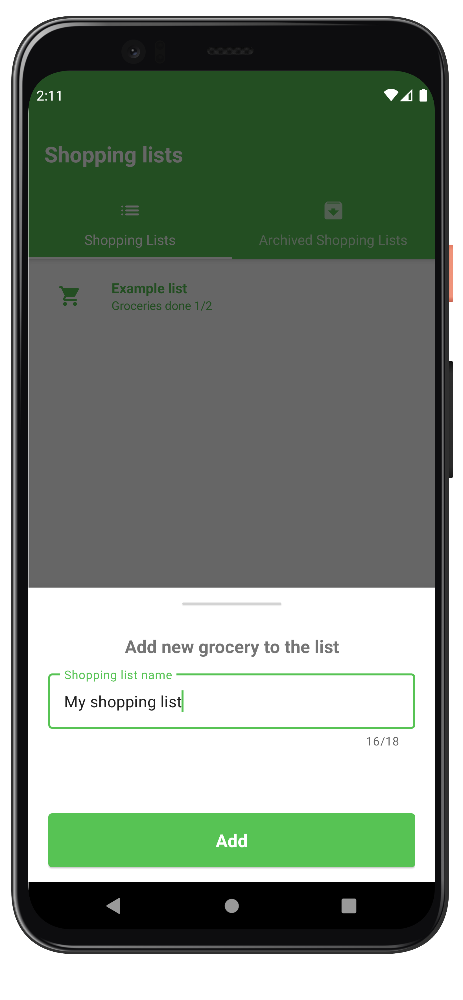
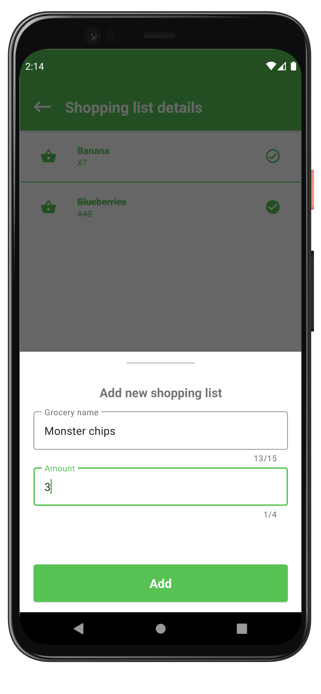
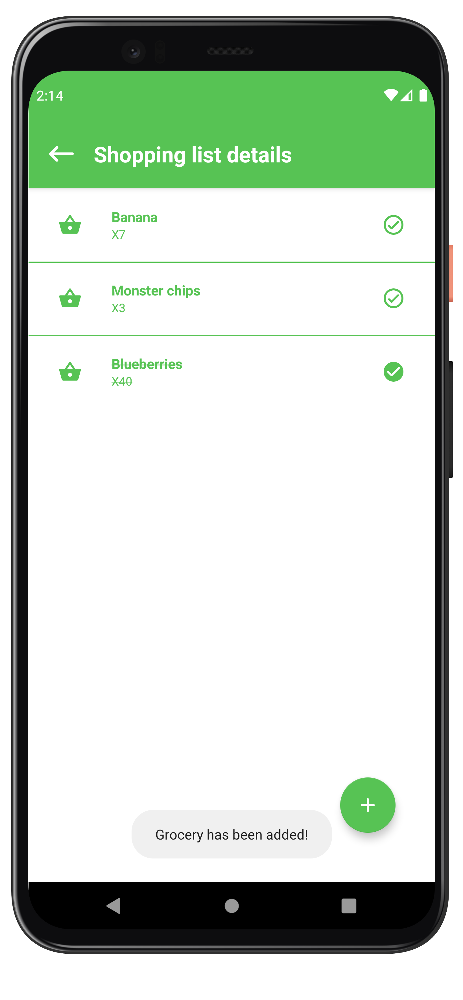

# 🛒 Shopping list 
Simple Shopping list app where you can create a new shopping list and add items to buy.

	
	 
	
	

## 📝 General info
A simple application that allows you to create a shopping lists and stores completed. The main view contains lists and a button for adding a new one, after clicking it, a dialogue will open with the possibility of naming a new shopping list. After entering the list, we have a list of our products. We can add new ones using the button that will start a dialogue with the possibility of entering the name and quantity. Clicking on a product will check or uncheck it (_products in the archived list cannot be uncheck!_).

## 🛠 Technologies
Project is mainly created with **Kotlin** and partly with **Java**.

📚 Libraries:
* [Hilt](https://developer.android.com/training/dependency-injection/hilt-android)
* [Kotlin Coroutines](https://kotlinlang.org/docs/reference/coroutines-overview.html)
* [ROOM](https://developer.android.com/jetpack/androidx/releases/room)
